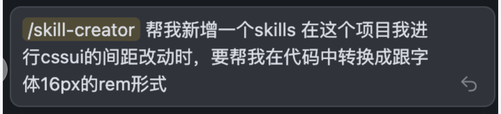
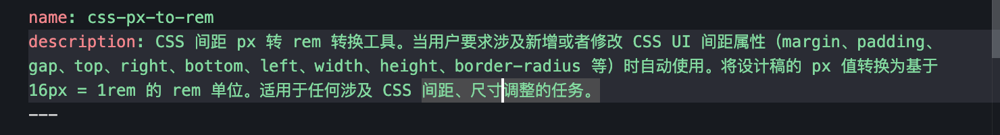
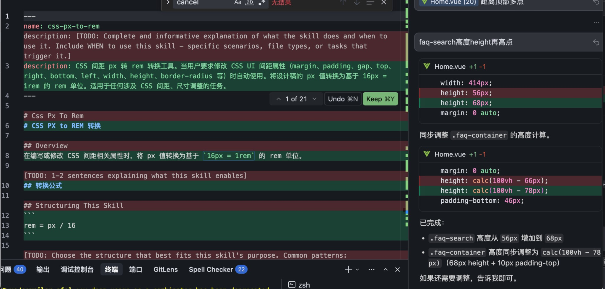
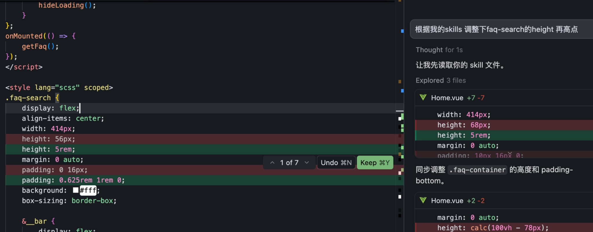

# Cursor Agent Skills 指南

> 🚀 让你的 Cursor 从"代码助手"进化为"超级 Agent"

## 📖 目录

- [什么是 Agent Skills？](#什么是-agent-skills)
- [Skills 的核心特点](#skills-的核心特点)
- [Skills 与 MCP 的区别](#skills-与-mcp-的区别)
- [Skills 目录结构](#skills-目录结构)
- [SKILL.md 文件格式](#skillmd-文件格式)
- [实战应用场景](#实战应用场景)
- [将规则和命令迁移到技能](#将规则和命令迁移到技能)
- [Skills 平台一览](#skills-平台一览)
- [常见问题与解决方案](#常见问题与解决方案)
- [总结](#总结)

---

## 什么是 Agent Skills？

**Agent Skills** 是一种用于为 AI Agent 扩展专门能力的**开放标准**。你可以把 Skills 理解为 AI Agent 的"技能包"——它将特定领域的知识、工作流程和工具打包在一起，让 Agent 能够执行更专业的任务。

与 MCP 协议连接外部工具不同，Skills 更侧重于提供**知识和指令**，告诉 Agent "如何"完成某类任务。

> 💡 **核心理念**：在 Chat 框里写 Prompt 是"软约束"，AI 可能会听，也可能会幻觉。**Skills 是"硬约束"**——一套标准化的 SOP（标准作业程序）和工具包。

---

## Skills 的核心特点

| 特点 | 说明 |
|------|------|
| **可移植** | 技能可以在任何支持 Agent Skills 标准的 Agent 中使用，不局限于 Cursor |
| **版本控制** | 技能以文件形式存储，可以在代码仓库中进行管理和追踪 |
| **可执行** | 可以包含 Agent 能够执行的脚本和代码（Python/Bash 等） |
| **模块化** | 每个技能是独立的模块，可以按需组合使用 |
| **渐进式加载** | 按需加载资源，保持上下文使用高效 |
| **自动触发** | Agent 会根据任务上下文自动判断并调用相关技能 |

---

## Skills 与 MCP 的区别

| 对比项 | MCP (Model Context Protocol) | Skills |
|--------|------------------------------|--------|
| **核心定位** | 连接外部工具和服务的协议 | 提供知识和指令的技能包 |
| **主要功能** | 让 AI 调用外部 API、数据库、服务等 | 告诉 AI "如何"完成某类任务 |
| **侧重点** | **能力扩展**（做什么） | **方法指导**（怎么做） |
| **内容形式** | 工具定义、API 接口 | 文档、脚本、工作流程 |
| **典型用例** | 读写数据库、调用第三方 API、文件操作 | 生成 PPT、代码审查、部署流程 |
| **触发方式** | AI 根据需要调用工具 | AI 根据上下文自动应用或手动 `/` 调用 |

> 💡 **简单理解**：MCP 是给 AI 装上"手脚"（工具），Skills 是给 AI 装上"大脑"（知识和方法）。两者可以配合使用——Skills 定义工作流程，MCP 提供执行工具。

---

## Skills 目录结构

Skills 会从以下位置自动加载：

| 位置 | 作用域 |
|------|--------|
| `.cursor/skills/` | 项目级别 |
| `.claude/skills/` | 项目级别（Claude 兼容） |
| `.codex/skills/` | 项目级别（Codex 兼容） |
| `~/.cursor/skills/` | 用户级别（全局） |
| `~/.claude/skills/` | 用户级别（全局，Claude 兼容） |

标准的 Skill 目录结构：

```
skill-name/
├── SKILL.md          # 必需：技能定义文件
├── scripts/          # 可选：可执行脚本（Python/Bash等）
│   ├── deploy.sh
│   └── validate.py
├── references/       # 可选：参考文档
│   └── REFERENCE.md
└── assets/           # 可选：模板、图标等资源文件
    └── config-template.json
```

---

## SKILL.md 文件格式

每个技能都在 `SKILL.md` 文件中定义，使用 YAML frontmatter：

```markdown
---
name: my-skill
description: 简短描述这个技能做什么以及何时使用它
license: MIT
disable-model-invocation: false
---

# My Skill

详细的 Agent 指令说明。

## When to Use

- 当用户需要...时使用此技能
- 此技能适用于...场景

## Instructions

- 步骤化的 Agent 指导
- 领域特定的约定
- 最佳实践和模式
- 如需澄清需求，使用提问工具询问用户
```

### Frontmatter 字段说明

| 字段 | 必需 | 描述 |
|------|------|------|
| `name` | ✅ | 技能标识符，仅允许小写字母、数字和连字符，必须与父文件夹名称匹配 |
| `description` | ✅ | 描述技能的功能和使用场景，Agent 用此判断相关性 |
| `license` | ❌ | 许可证名称或引用 |
| `compatibility` | ❌ | 环境要求（系统包、网络访问等） |
| `metadata` | ❌ | 任意键值对的附加元数据 |
| `disable-model-invocation` | ❌ | 设为 `true` 时，仅通过 `/skill-name` 显式调用 |

---

## 实战应用场景

### 场景一：一句话生成技术 PPT 📊

直接在 Cursor 对话框输入：

```
调用 pptx skills，根据最近的 git commit 记录，整理一份最近改动点的汇总 PPT。
```

**Cursor 的执行路径：**
1. 读取 `AGENTS.md` 发现有 `pptx` 技能
2. 自动抓取 git log
3. 调用 Python 脚本生成 `.pptx` 文件

结果：一份结构清晰、配色专业的 PPT 直接出现在你的目录里！

### 场景二：让 AI 自己写 Skill 🛠️

使用 `skill-creator` 让 AI 根据需求自动编写新的 Skill：

```
我经常需要分析 /fixes 目录下的修改记录。
请调用 skill-creator，帮我做一个自动生成"改动报表"的 Skill。
```

**AI 的操作：**
1. 分析你的需求
2. 自动编写 Python 脚本
3. 定义输入输出
4. 注册到 `AGENTS.md` 中


### 场景三：使用 antfu/skills 进行 Vue/Vite/Nuxt 开发 🎯

[antfu/skills](https://github.com/antfu/skills) 是 Anthony Fu 维护的一站式 Skills 集合，专为 Vue/Vite/Nuxt 技术栈打造。

**安装命令：**

```bash
# 安装所有 skills
pnpx skills add antfu/skills --skill='*'

# 或全局安装
pnpx skills add antfu/skills --skill='*' -g
```

**包含的 Skills：**

| 类别 | Skills | 说明 |
|------|--------|------|
| **核心偏好** | `antfu` | Anthony Fu 的开发偏好（TypeScript 严格模式、pnpm、ESM only） |
| **框架** | `vue`、`nuxt`、`pinia` | Vue 3 Composition API、Nuxt 路由/模块、Pinia 状态管理 |
| **构建工具** | `vite`、`vitest`、`tsdown` | Vite 配置/插件、Vitest 单元测试、tsdown 库打包 |
| **样式** | `unocss` | UnoCSS 原子化 CSS 引擎 |
| **文档** | `vitepress` | VitePress 静态站点生成 |
| **工具库** | `vueuse-functions` | 200+ Vue 组合式工具函数 |
| **最佳实践** | `vue-best-practices`、`vue-testing-best-practices` | Vue 3 + TypeScript 最佳实践 |

**使用示例：**

```
帮我用 Vue 3 + TypeScript 创建一个带有深色模式切换的响应式布局组件
```

Agent 会自动调用 `vue`、`antfu` 等相关 skills，按照现代化的最佳实践生成代码：
- 使用 Composition API + `<script setup lang="ts">`
- 遵循 Anthony Fu 的 ESLint 配置风格
- 优先使用 `shallowRef` 而非不必要的深层响应式

> 💡 **特点**：这个集合使用 Git submodules 直接引用源文档，能够与上游保持同步更新，提供更可靠的上下文。

---

## 将规则和命令迁移到技能

Cursor 在 2.4 版本中内置了 `/migrate-to-skills` 技能，帮助你将现有的动态规则和斜杠命令转换为技能。

### 迁移步骤

1. 在 Agent 聊天中输入 `/migrate-to-skills`
2. Agent 会识别符合条件的规则和命令并将其转换为技能
3. 在 `.cursor/skills/` 中查看生成的技能

### 实践案例

调用 `/migrate-to-skills` 后，Agent 会自动扫描并识别可迁移的规则：


**注意**：如果 Agent 错误地尝试迁移 `alwaysApply: true` 的规则，需要及时纠正：


> 💡 **要点**：`alwaysApply: true` 的规则始终加载到上下文中，而 Skills 是按需触发、基于 description 匹配的，两者行为不同，不应混淆。

### 不会迁移的内容

以下内容不会被迁移，因为它们有与技能行为不同的显式触发条件：

- 具有 `alwaysApply: true` 的规则（始终应用的规则）
- 具有特定 `globs` 模式的规则（基于文件模式触发）
- 用户规则（User Rules）——因为它们不存储在文件系统中

---

## Skills 平台一览

### 官方平台

| 平台 | 地址 | 说明 |
|------|------|------|
| **Skills.sh** | https://skills.sh | Vercel 提供的 Skills 官方目录，可浏览、搜索和安装各类 Skills |
| **anthropics/skills** | https://github.com/anthropics/skills | Anthropic 官方 Skills 仓库（66k+ Stars），包含规范、模板和示例 Skills |
| **Qoder Community** | https://qoder-community.pages.dev/skills/ | 54+ 精选 Skills，按职业角色分类推荐（开发者、设计师、产品经理等） |
| **Skills Marketplace** | https://skillsmp.com/ | Skills 增长趋势追踪，内容齐全，支持分类筛选和排序 |

### 知名 Skills 仓库

| 仓库 | 安装命令 | 说明 |
|------|----------|------|
| **anthropics/skills** | `npx skills add anthropics/skills` | Anthropic 官方 Skills，包含 skill-creator 等工具 |
| **vercel-labs/skills** | `npx skills add vercel-labs/skills` | Vercel Labs 官方，包含 find-skills、React 最佳实践等 |
| **antfu/skills** | `npx skills add antfu/skills --skill='*'` | Anthony Fu 维护，Vue/Vite/Nuxt/Pinia/VueUse 全家桶 |
| **vuejs-ai/skills** | `npx skills add vuejs-ai/skills` | Vue.js AI 技能集，包含 Vue 开发指南和最佳实践 |
| **remotion-dev/skills** | `npx skills add remotion-dev/skills` | Remotion 视频制作框架技能 |
| **ComposioHQ/awesome-claude-skills** | `npx skills add ComposioHQ/awesome-claude-skills` | 社区精选 Claude Skills 集合 |

### Skills CLI 常用命令

```bash
# 搜索 Skills
npx skills find <关键词>

# 安装单个 Skill
npx skills add <owner/repo> --skill <skill-name>

# 安装仓库所有 Skills
npx skills add <owner/repo> --skill='*'

# 全局安装
npx skills add <owner/repo> -g

# 仅安装到 Cursor
npx skills add <owner/repo> --host cursor

# 检查更新
npx skills check

# 更新所有 Skills
npx skills update

# 创建新 Skill
npx skills init <skill-name>
```

### 快速开始推荐

如果你是 Vue/前端开发者，推荐一键安装 Anthony Fu 的全套 Skills：

```bash
npx skills add antfu/skills --skill='*' -g
```

这将安装包括 Vue、Nuxt、Vite、Vitest、Pinia、VueUse 等在内的完整开发技能集。
地址： https://github.com/antfu/skills?tab=readme-ov-file

---

## 常见问题与解决方案

在使用 Skills 的过程中，你可能会遇到 Agent 没有正确识别或使用 Skills 的情况。以下是一些常见问题及解决方案：

### 问题一：Agent 没有自动识别 Skills

**现象**：明明安装了相关的 Skills，但 Agent 在回答问题时并没有自动调用它们。

例如，当你问 **"这个 vue 文件有什么优化空间"** 时，Agent 应该自动识别并使用以下 Skills：

| Skill | 触发条件 |
|-------|----------|
| `vue-best-practices` | "MUST be used for Vue.js tasks" - 任何 Vue.js 任务都**必须**使用 |
| `vue-development-guides` | "This skill MUST be apply when developing, refactoring or reviewing" |
| `vueuse-functions` | "Apply VueUse composables where appropriate" - 在合适时应用 |

**为什么应该自动触发？**

1. 涉及 `.vue` 文件 → 应触发 Vue 相关 skills
2. 涉及代码审查/优化 → 符合 "reviewing" 条件
3. 项目中已使用 VueUse（如 `useLocalStorage`）→ 应参考 vueuse-functions

> 💡 **关键点**：你**不需要说任何特定的关键词**！只要任务与 Skill 的 `description` 描述的适用范围匹配，Agent 就应该**主动**使用它们。

**实际案例：CSS px 转 rem 的 Skill 未被自动识别**

1. **创建了自定义 Skill** `css-px-to-rem`，description 已明确说明适用场景：





2. **Agent 未自动应用**：当要求调整 CSS 间距时，Agent 直接使用 px 单位，没有调用已创建的 Skill：



3. **手动指引后才正确使用**：明确提示"根据我的 skills"后，Agent 才正确应用了 px 转 rem 的转换规则：



> ⚠️ **这说明**：即使 Skill 的 `description` 已经明确说明适用场景，Agent 有时仍需要手动提示才会使用。

---

### 问题二：多个 Skills 之间的优先级混乱

**现象**：安装了多个相关 Skills，Agent 不知道应该优先使用哪个。

**解决方案**：

- 在提问时明确指定使用哪个 Skill：`/vue-best-practices 帮我审查这段代码`
- 优化 Skill 的 `description`，使其更精确地描述适用场景

---

### 如何帮助 Agent 更好地使用 Skills？

| 情况 | 解决方法 |
|------|----------|
| Agent 没有触发任何 Skill | 提醒："请先读取相关的 Skills" |
| 想使用特定 Skill | 使用 `/skill-name` 显式调用 |
| Agent 疏忽了某个 Skill | 反馈给 Agent，帮助它学习 |


---

## 总结

> 🎯本质：就是 Prompt + 知识库 + 执行脚本 的结构化封装
未来或许每个人、每个框架、每个公司，都会维护一套属于自己的 Skills 库。
---
